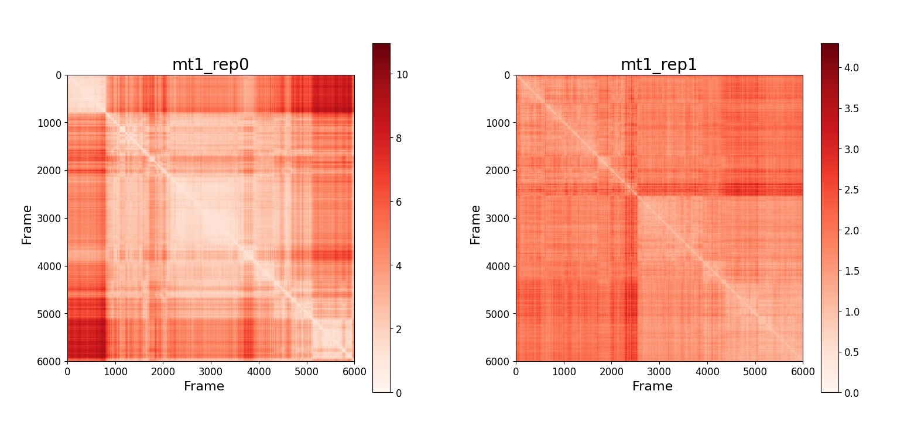

# General Analysis
## RMSD
From the trajectories visualized in VMD it can be seen how the protein fluctuates during its evolution in water. The first frame, which is the PDB file taken from cristallographic experiments, represents the protein in a structure far from equilibrium. 
During its evolution, the system should move towards a minimum of the free energy, and reach more stable configurations. 
We wonder if the system reaches an equilibrium configuration, and if there are some transitions from a metastable configuration to another.
To explore this behaviour we can calculate the root mean square deviation, RMSD, for each trajectory.  
The RMSD between two frames is defined as
$$ RMSD(\Delta t) = \sqrt{\frac{1}{N}\sum_{i=1}^{N}(x_{i}(\Delta t)-x_{i}(0))^{2}}$$
where
- $N$ is the number of atoms in the protein
- $\Delta t$ is the time step 
- $x_{i}(\Delta t)$ is the position of atom $i$ at time $\Delta t$ 

It is important to remember that this quantity is only an indicator of the stability of the system. If a pateau is reached it means that the protein can be at equilibrium, but it important to notice that this is not always the case. 

Before calculating the RMSD it is necessary to perform an alignment between the structures.
In a first step the centers of mass of the structure that have to becompared are superimposed. Then one of the structures is rotated with respect to the other. Finally, the RMSD is calculated. 

We performed the alignment in the post processing step of the MD simulation, then we can calculate the RMSD and analyse the results.
### RMSD in 1D
We calculate the RMSD in 1 dimension, taking each frame as the reference. In the following graphs the blu points refer to the rep0 and the red ones to rep1. 
RMSD_1D_COMPARE:
- mt1_rep0 & mt1_rep1
- mt2_rep0 & mt2_rep1
- wt1_rep0 & wt1_rep1
- wt2_rep0 & wt2_rep1
### RMSD in 2D
It is also possible to build a RMSD matrix and represent it using an heatmap. 
RMSD_2D:

- mt1_rep0 & mt1_rep1
- mt2_rep0 & mt2_rep1
- wt1_rep0 & wt1_rep1
- wt2_rep0 & wt2_rep1

## RMSF
The protein is composed of many atoms which move during the evolution of the system. To understand which parts of the protein are more mobile it is useful to calculate the root mean square fluctuations for each atom. 
The RMSF related to atom $i$ is defined as:
$$ RMSF_{i} = \sqrt{<\Delta \vec{r_{i}}>^{2}} $$
where $<\Delta \vec{r_{i}}>$ is the mean deviation of the atom from its equilibrium position. 

In the graphs below it can be seen that some atoms have a larger RMSF, meaning that they are more mobile during the evolution of the protein.

RMSF_COMPARE:
- mt1_rep0 & mt1_rep1
- mt2_rep0 & mt2_rep1
- wt1_rep0 & wt1_rep1
- wt2_rep0 & wt2_rep1

RMSF_COMPARE:
- mt2_rep0 & wt2_rep0
- mt1_rep0 & mt2_rep0
- wt1_rep0 & wt2_rep0

## Radius of Gyration

The protein seems to have 
RGYR_COMPARE:
    - mt1_rep0 & mt1_rep1
    - mt2_rep0 & mt2_rep1
    - wt1_rep0 & wt1_rep1
    - wt2_rep0 & wt2_rep1

## Contact Map

CMAP_COMPARE:
    - mt1_rep0 & mt2_rep0

non possiamo fare un confronto generale come quelli fatti per rmsd, rmsf, gryr perché il pdb iniziale è lo stesso. 

ha senso fare l'analisi con frames specifici. 
