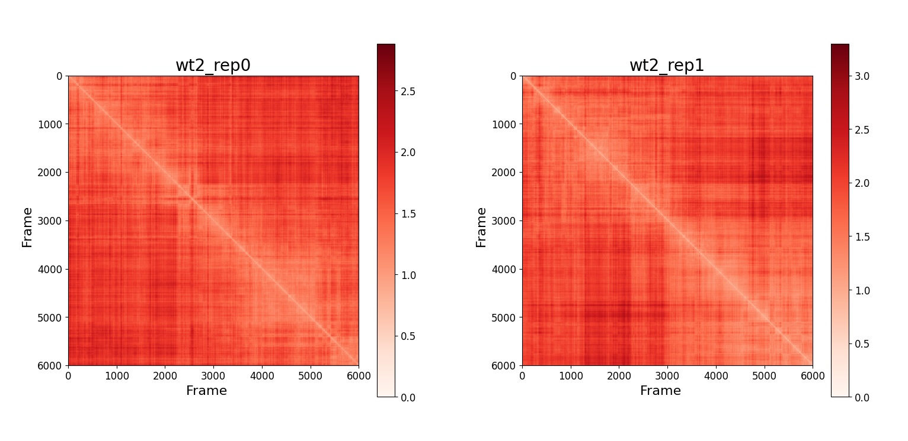
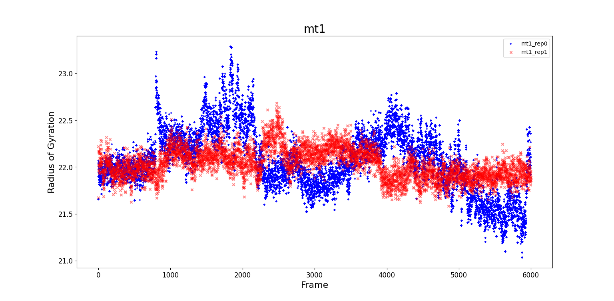
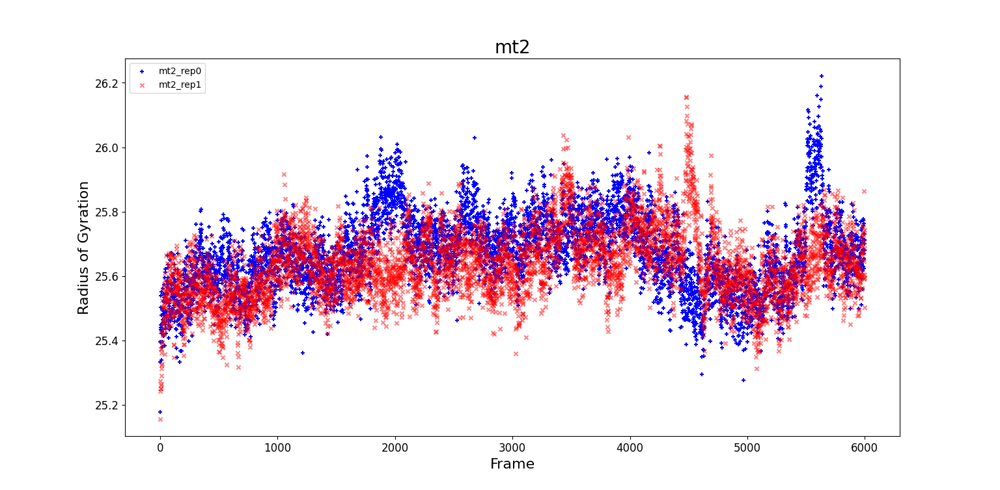
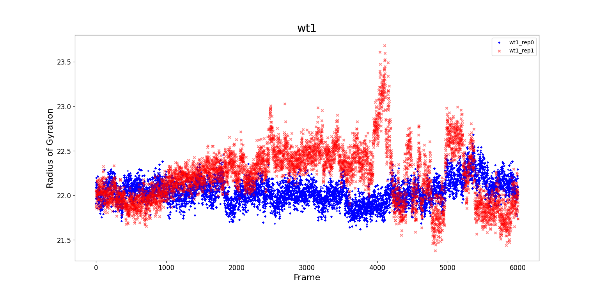
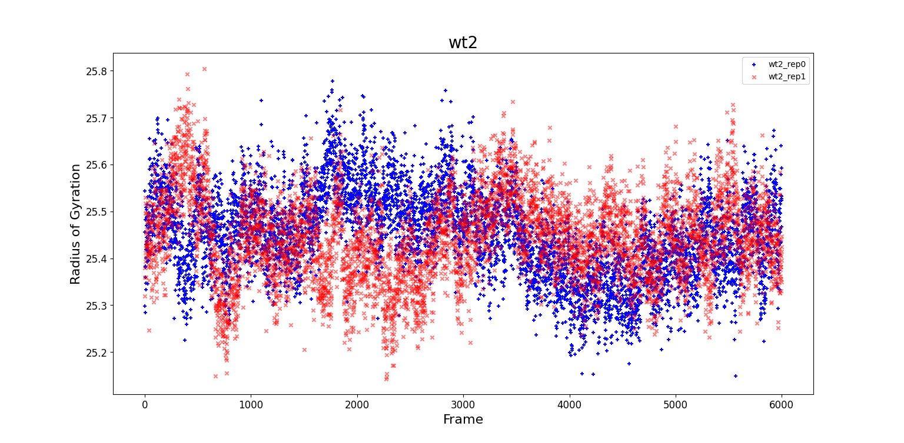

# General Analysis
## RMSD
From the trajectories visualized in VMD it can be seen how the protein fluctuates during its evolution in water. The first frame, which is the PDB file taken from cristallographic experiments, represents the protein in a structure far from equilibrium. 
During its evolution, the system should move towards a minimum of the free energy, and reach more stable configurations. 
We wonder if the system reaches an equilibrium configuration, and if there are some transitions from a metastable configuration to another.
To explore this behaviour we can calculate the root mean square deviation, RMSD, for each trajectory.  
The RMSD between two frames is defined as
$$ RMSD(\Delta t) = \sqrt{\frac{1}{N}\sum_{i=1}^{N}(x_{i}(\Delta t)-x_{i}(0))^{2}}$$
where
- $N$ is the number of atoms in the protein
- $\Delta t$ is the time step 
- $x_{i}(\Delta t)$ is the position of atom $i$ at time $\Delta t$ 

It is important to remember that this quantity is only an indicator of the stability of the system. If a pateau is reached it means that the protein can be at equilibrium, but it important to notice that this is not always the case. 

Before calculating the RMSD it is necessary to perform an alignment between the structures.
In a first step the centers of mass of the structure that have to becompared are superimposed. Then one of the structures is rotated with respect to the other. Finally, the RMSD is calculated. 

We performed the alignment in the post processing step of the MD simulation, then we can calculate the RMSD and analyse the results.
### RMSD in 1D
We calculate the RMSD in 1 dimension, taking each frame as the reference. In the following graphs the blu points refer to the $rep0$ and the red ones to $rep1$.
In the following graphs the RMSD is calculated with respect to the initial frame. 

The noise is quite high, and it is not straightforward to identify the stable or equilibrium regions on the graphs.

The RMSD appear to be very different, since the values calculated for $rep1$ are similar to the $rep0$ of the wild type. We checked that the initial GRO files were the correct ones. We think that in $rep0$, but not in $rep1$, something happen around frame 900 and a change in the configuration occurs. In $rep0$ we observe an equilibrium region approximately between frame 2100 and frame 3800. Before frame 2000 an extremly noisy region occurs, and after frame 4000 it seems that the configuration of the protein changes.

In $rep1$ the RMSD fluctuates around a constant value and it is much less noisy than the $rep0$ one. The only relevant change occurs between frame 2000 and frame 3000. 

The RMSD of $rep0$ and $rep1$ are compared taking as reference different frames. The $rep1$ values slightly oscillate around a constant value, while the values for the $rep0$ show a more dynamic trend. It can be observed that when the reference frame is approximately between frame 2100 and frame 5000 the two RMSD tend to coincide in the central region. 

The same comparison has been done for all the following graph, but we are not going to show them since the results are similar to the one in the graph above. 

The values for the two repetitions quite agree, but around frame 5000 the RMSD for $rep0$ is slightly lower than the one of $rep1$. 

The RMSD of $rep0$ is quite low and it seems to oscillate around a constant value. It seems that do not occur major changes of configuration. The RMSD of $rep1$ undergoes several changes. Until frame 800 it changes abruptly, someting happens and the protein changes configuration. Until frame 4000 it seems that the protein stays in the same equilibrium configuration, only a peack occurs. Then a second change of configuration can be observed.   

The RMSD values are extremly noisy, but the values of the two repetitions seem to agree quite well. 

### RMSD in 2D
It is also possible to build a RMSD matrix and represent it using an heatmap. The RMSD graphs represented above correspond to the first row in the respective matrix.

The matrix are symmetric, and the values on the diagonal are $0$.

In $rep0$ map it seems a change in configuration occurs around frame 800. Other changes inconfiguration occurs but the contrast is lower. In $rep1$ map the contrast is much lower, meaning that the protein does not undergoes major changes in its configurations. It is interesting to observe that two changes in the protein structure occur around frame 2500. In the 1D graph we could not grasp this information, because the RMSD are noisy.

In $rep0$ only a change in the configuration occur around frame 5500. In $rep1$ several changes occurs, and the value of RMSD is in general higher than the ones in $rep0$. 

Here we observe two deeply different behaviour in the RMSD. In $rep0$ the values are substantially constant and it seems that no important changes in the configuration occur. In $rep1$ a clear change in the configuration occurs around frame 4000. 

## RMSF
The protein is composed of many atoms which move during the evolution of the system. To understand which parts of the protein are more mobile it is useful to calculate the root mean square fluctuations for each atom. 
The RMSF related to atom $i$ is defined as:
$$ RMSF_{i} = \sqrt{<\Delta \vec{r_{i}}>^{2}} $$
where $<\Delta \vec{r_{i}}>$ is the mean deviation of the atom from its equilibrium position. 

In the graphs below it can be seen that some atoms have a larger RMSF, meaning that they are more mobile during the evolution of the protein.

RMSF_COMPARE:
- mt2_rep0 & mt2_rep1
- wt1_rep0 & wt1_rep1
- wt2_rep0 & wt2_rep1

RMSF_COMPARE:
- mt2_rep0 & wt2_rep0
- wt1_rep0 & wt2_rep0

## Radius of Gyration
From VMD it can be observed that even though the protein fluctuates, its shape remains constant. To check if the protein elongates during its evolution it is useful to calculate the radius of gyration:
$$ RGYR(\Delta t) = \sqrt{\frac{\sum_{i=1}^{N}m_{i}(r_{i}(\Delta t)-R_{cm})^{2}}{\sum_{i=1}^{N} m_{i}}}$$
where 
- $m_{i}$ is the mass of atom $i$
- $r_{i}$ is the position of atom $i$ at time $\Delta t$ 
- $R_{cm}$ is the center of mass

## Contact Map
The protein is constituted by a folded chain composed of atoms linked together. Non subsequent atoms can be near enough to interact even if they are not adjacent. The contact maps shows the links between atoms only for a single frame, and a more detailed analysis of interactions in the protein is performed in the following part of this work.
The contact map is defined in 2D, then it is not possible to overlap the graphs as we did for RMSF, RMSD and RGYR.
Here we show as an example some contact maps calculated at the initial frame of the trajectory. The initial frame is the same for the two trajectories, namely rep0 and rep1, then the contact map results to be the same.

CMAP_COMPARE:
- mt1_rep0 & mt2_rep0